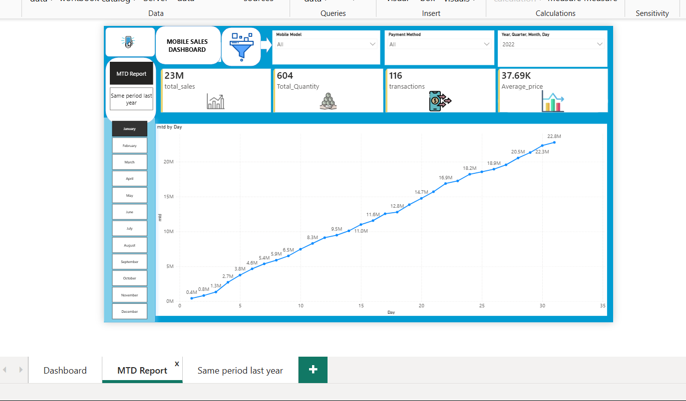
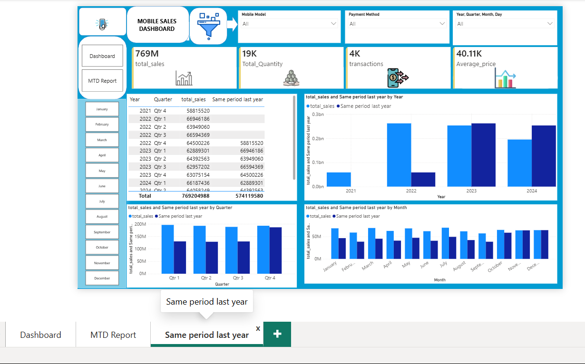

# 📱 Mobile Sales Dashboard — Power BI Project

An interactive Power BI dashboard analyzing mobile phone sales data — covering revenue trends, city-wise distribution, payment methods, ratings, and year-over-year performance comparisons.

---

## 🎯 Project Overview

This dashboard provides a complete view of mobile sales performance including:
- Total sales, quantity sold, transactions, and average price
- City-wise sales distribution across India (map visualization)
- Monthly sales and quantity trends
- Customer ratings breakdown
- Payment method analysis
- Brand and model-wise performance
- Month-to-Date (MTD) tracking
- Year-over-year and quarter-over-quarter comparisons

---

## 🛠️ Tools & Technologies Used

- **Power BI Desktop** — data modeling, DAX measures, and visualization
- **DAX** — for calculated measures (e.g., `total_sales = SUMX(...)`)
- **Excel** — source data
- **Power BI Data Categories & Map Visuals** — for geographic (city-wise) analysis

---

## 📊 Dashboard Pages

### 1️⃣ Main Dashboard
Overview of KPIs (Total Sales, Quantity, Transactions, Average Price), city-wise sales map, monthly quantity trend, ratings breakdown, payment method split, and brand/model performance.


---

### 2️⃣ MTD (Month-to-Date) Report
Tracks cumulative sales progress day-by-day within the selected month, along with quantity, transactions, and average price for that period.



---

### 3️⃣ Same Period Last Year
Compares current performance against the same period in previous years — broken down by Year, Quarter, and Month — to identify growth trends.



---

## 📈 Key Insights

- Total Sales: **769M**
- Total Quantity Sold: **19K units**
- Total Transactions: **4K**
- Average Price: **₹40.11K**
- Top performing brand: **Apple**
- Most used payment method: **UPI**

---

## 📂 Repository Structure

```
├── screenshots/
│   ├── dashboard-overview.png
│   ├── mtd-report.png
│   └── same-period-last-year.png
├── Mobile_Sales_Dashboard.pbix
└── README.md
```

---

## 📥 How to View

1. Download the `.pbix` file from this repository
2. Open it in **Power BI Desktop** (free to download from Microsoft)
3. Explore all three report pages using the tabs at the bottom

---

## 👤 Author

Built as part of a Power BI data visualization project.
